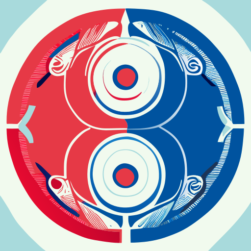

<!-- These are examples of badges you might want to add to your README:
     please update the URLs accordingly

-->

  

# ☯ primal-dual-approx-py

Approximation algorithms based-on primal-dual thinking

## Description

A longer description of your project goes here...

## Depend on

- [mywheel](https://github.com/luk036/mywheel)
- networkx

<!-- pyscaffold-notes -->

## 👉 Note

This project has been set up using PyScaffold 4.5. For details and usage
information on PyScaffold see https://pyscaffold.org/.
